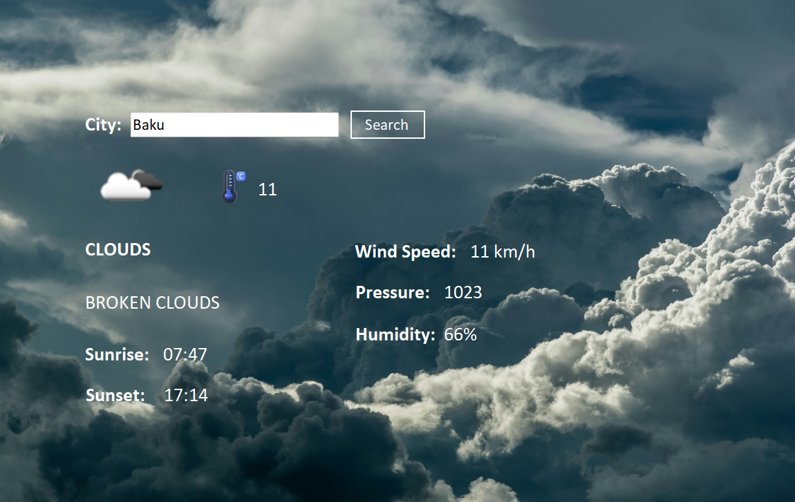

## 🌦️ Weather App
A simple and user-friendly weather application powered by the OpenWeather API. This app provides real-time weather information, including temperature, wind speed, and more, for any location worldwide.
## 🛠 Features  
- 🌍 **Search for weather by city name.**  
- 📊 **Display temperature, humidity, wind speed, and direction.**  
- 🕒 **Real-time data updates.**  
- 🌞 **Clean and responsive user interface.**
## 📸 Screenshots
 
## 🚀 Installation  

Follow these steps to set up and run the Weather App locally:  

### 1. Clone the Repository  
First, clone this repository to your local machine:  
```bash  
git clone https://github.com/yourusername/weather-app.git  
cd weather-app
```
### 2. Install NuGet Package  
Install Newtonsoft.Json Package:
```bash  
dotnet add package Newtonsoft.Json
```
## 🧰 Technologies Used  
  
- **API:** OpenWeather API  
- **Backend:** .NET Windows Forms (WinForms)

## 🌐 API Reference
This app uses the OpenWeather API to fetch weather data.

## 👤 Author  

**Mahammad Piriyev**  

- LinkedIn: [My LinkedIn Profile](https://linkedin.com/in/mahammadpiriyev)  
- Portfolio: [My Portfolio Website](https://mahammadpiriyev.onrender.com/)  


